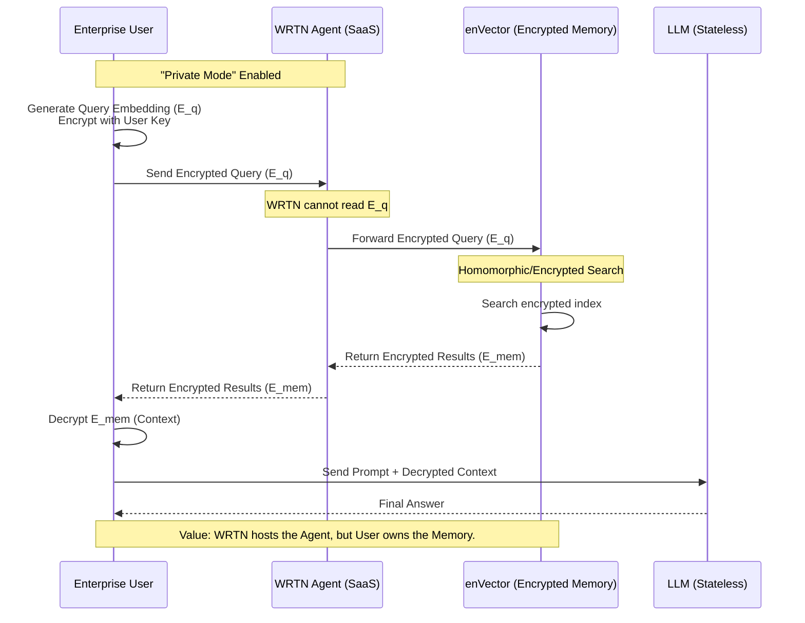
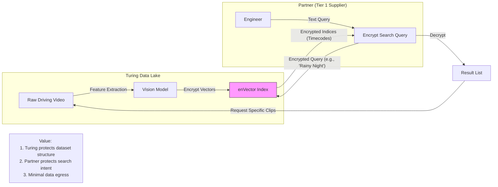
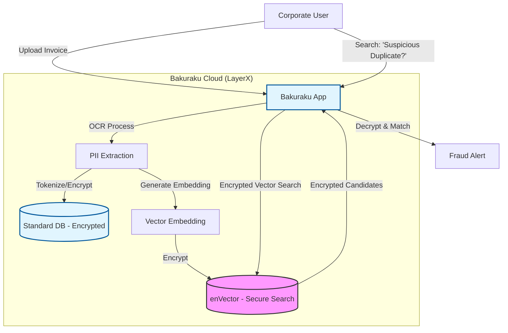
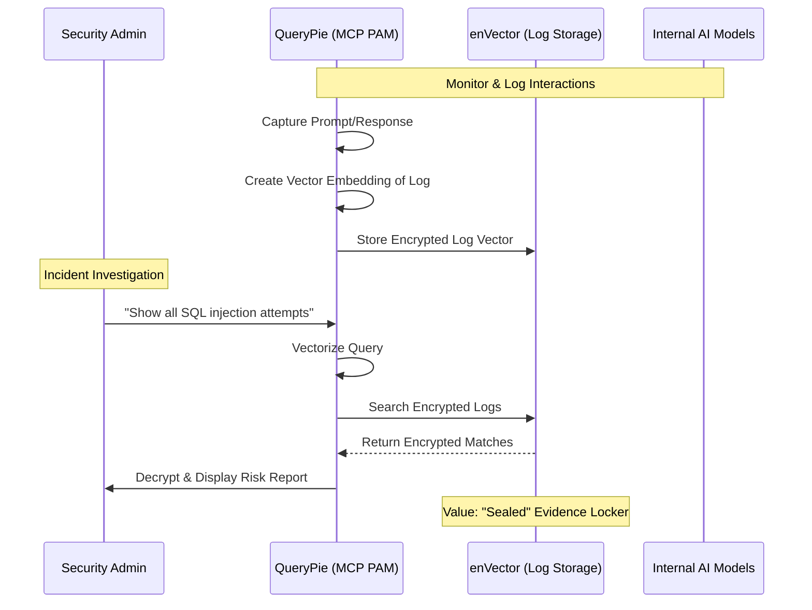
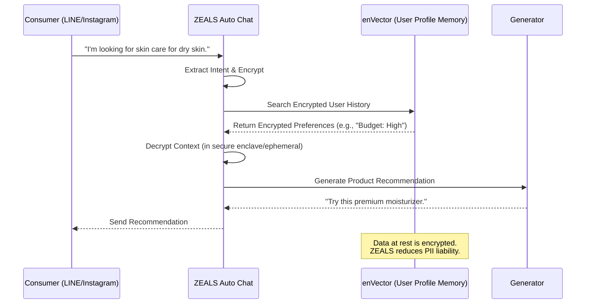
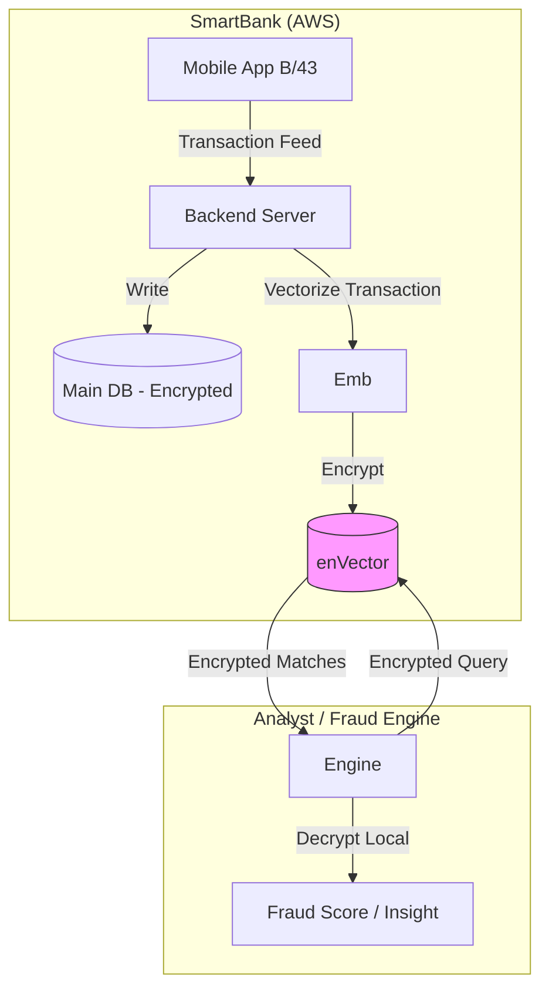
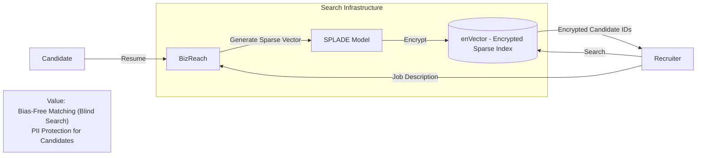
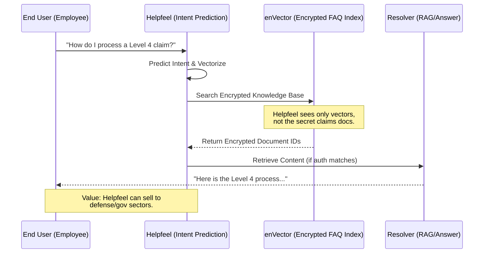

# Customer Value Integration: enVector
This document illustrates how `enVector` integrates with the specific business architectures of key potential customers to deliver "Monetizable Privacy" and "Regulatory Compliance."

## 1. WRTN Technologies (GenAI Agent Platform)
**Value Prop:** **"Zero-Knowledge Memory" for Enterprise Agents.**
WRTN can offer a "Private Mode" where even they (the platform provider) cannot access the user's Retrieval-Augmented Generation (RAG) history.

---

## 2. Turing Inc. (Autonomous Driving)
**Value Prop:** **Secure Data Exchange for Partners.**
Turing has vast driving datasets. Tier 1 suppliers or researchers want to search this data (e.g., "scenes with pedestrians at night") without Turing exposing the entire raw dataset or the partners exposing their proprietary search queries.

---

## 3. LayerX (Bakuraku - Fintech)
**Value Prop:** **Compliance-Ready Financial Search.**
Bakuraku handles sensitive invoices. `enVector` enables features like "Find similar past invoices" for fraud detection while keeping the data encrypted, satisfying strict financial regulations (GDPR/PCI-DSS compliant architecture).

---

## 4. CHEQUER (QueryPie - Security)
**Value Prop:** **Tamper-Proof Audit Logs for AI (MCP PAM).**
QueryPie acts as a gateway for AI agents. By storing the *audit logs* (who prompted what) in `enVector`, they ensure that the logs themselves are searchable by security teams but protected from tampering or leakage, even if the logging server is compromised.

---

## 5. ZEALS (Chat Commerce)
**Value Prop:** **Zero-Knowledge RAG for Personalized Ads.**
ZEALS uses RAG to power "Auto Chat." `enVector` ensures that the user's profile and conversation history (stored in vector memory) are encrypted, protecting consumer privacy while enabling highly personalized ad targeting.

---

## 6. SmartBank (B/43 - Fintech)
**Value Prop:** **Secure eKYC & Transaction Analysis.**
SmartBank focuses on "Household Finance." Analyzing spending habits creates a very detailed private profile. `enVector` allows them to build "Similar User" features or "Recurring Payment Detection" without exposing raw financial history to the analysis engine.

---

## 7. Visional (BizReach - HR Tech)
**Value Prop:** **Privacy-Preserving Resume Matching (SPLADE).**
Visional uses "Sparse Vector Search" (SPLADE) for matching. `enVector` can support encrypted sparse vectors, allowing them to match candidates to job descriptions without the matching engine "seeing" the candidate's name or current employer, preventing bias and leakage.

---

## 8. Helpfeel (Enterprise Search SaaS)
**Value Prop:** **"Secure Search" as a Premium Feature.**
Helpfeel's core value is "Findability." For clients like banks or insurance firms, internal knowledge bases contain sensitive operational info. `enVector` allows Helpfeel to offer a "Zero-Trust FAQ" where the index is encrypted.

